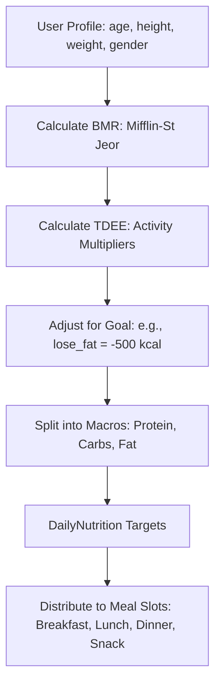
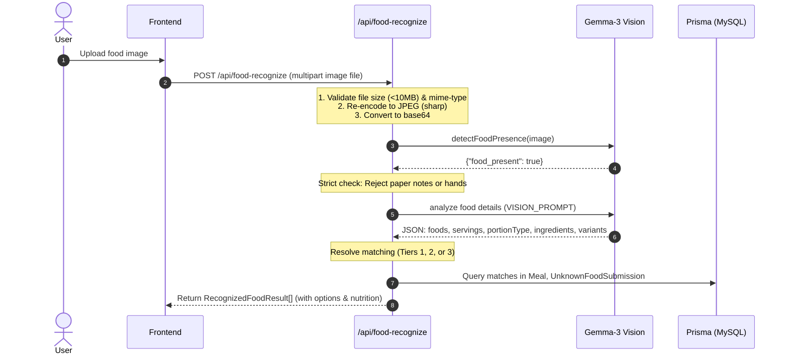
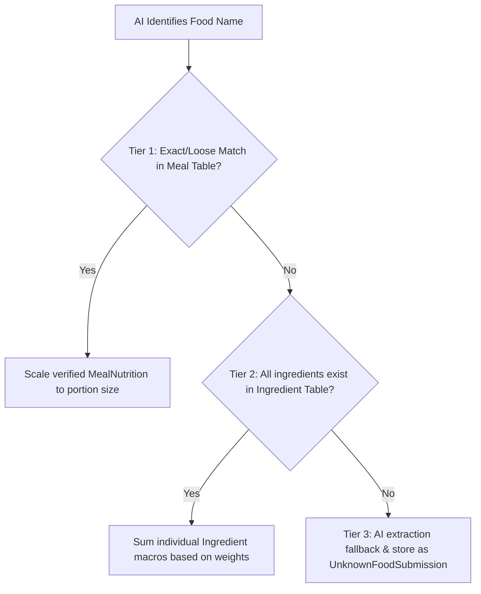
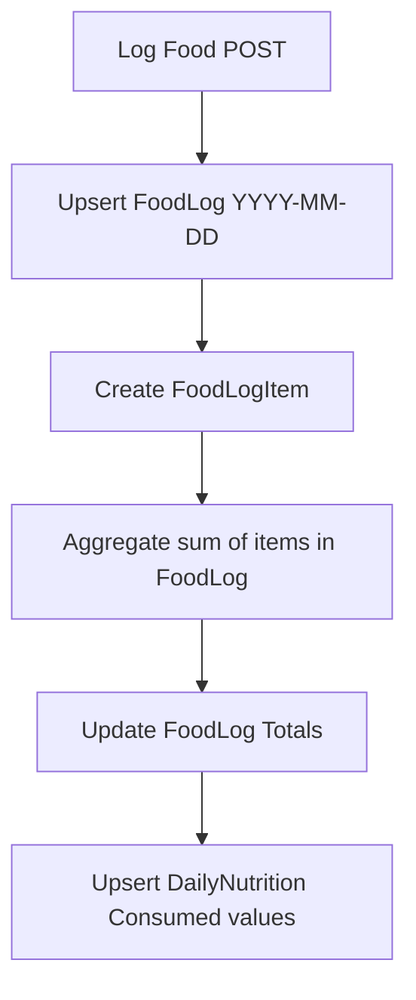

# Nutrient and AI Recommendation System Deep Dive

This document details how the AI-assisted nutrition tracking system works under the hood. It covers user calculations (TDEE/Macros), meal recommendation ranking, food image uploading and detection, database integration, and the exact data flows between database tables.

---

## 1. User Daily Targets & Slot Calculations

Before recommending meals or tracking daily nutrients, the system calculates the user's daily budget.



### A. TDEE & Target Calories Calculation
The system calculates the **Basal Metabolic Rate (BMR)** using the **Mifflin-St Jeor Equation** in [nutrition-engine.ts](file:///c:/Users/SAYYED%20HABEEB/Downloads/SwapFit/Z%20ai%20swapp/src/lib/nutrition-engine.ts):
*   **Males:** $BMR = 10 \times \text{weightKg} + 6.25 \times \text{heightCm} - 5 \times \text{age} + 5$
*   **Females:** $BMR = 10 \times \text{weightKg} + 6.25 \times \text{heightCm} - 5 \times \text{age} - 161$
*   **Other/Non-binary:** Average of male and female BMR.

Then, the BMR is multiplied by the user's **Activity Level multiplier** to determine their **Total Daily Energy Expenditure (TDEE)**:
*   `sedentary`: 1.2
*   `lightly_active`: 1.375
*   `moderately_active`: 1.55
*   `very_active`: 1.725
*   `extra_active`: 1.9

The final **Target Calories** are adjusted depending on the user's **Goal Type**:
*   `lose_fat`: TDEE - 500 kcal
*   `recomp` (body recomposition): TDEE - 250 kcal
*   `maintain`: TDEE + 0 kcal
*   `athlete`: TDEE + 300 kcal
*   `muscle_gain`: TDEE + 500 kcal
*   `weight_gain`: TDEE + 750 kcal

### B. Daily Macro Distributions
Daily macro goals are calculated based on the goal type (which can be overridden by `UserPreference.macroOverrideJson`):
*   **High Protein (`lose_fat`):** 40% Protein, 30% Carbs, 30% Fat.
*   **Balanced (`maintain` / `recomp`):** 30% Protein, 35%-40% Carbs, 30% Fat.
*   **High Carb (`muscle_gain` / `weight_gain`):** 25%-30% Protein, 45%-50% Carbs, 25% Fat.

$$\text{Protein (g)} = \frac{\text{Target Calories} \times \text{Protein \%}}{4 \text{ kcal/g}}$$
$$\text{Carbs (g)} = \frac{\text{Target Calories} \times \text{Carbs \%}}{4 \text{ kcal/g}}$$
$$\text{Fat (g)} = \frac{\text{Target Calories} \times \text{Fat \%}}{9 \text{ kcal/g}}$$

### C. Meal Slot Allocations
The system allocates budgets to each slot using standard percentages:
*   `breakfast`: 25%
*   `lunch`: 30%
*   `dinner`: 30%
*   `snack`: 15%

For example, when fetching recommendations for a slot, the system computes the remaining daily budget:
$$\text{Remaining Calories} = \text{Target Calories} - \text{Consumed Calories (today)}$$
$$\text{Slot Calories Target} = \text{Remaining Calories} \times \text{Slot \%}$$
$$\text{Slot Protein/Carbs/Fat Target} = \text{Daily Targets} \times \text{Slot \%}$$

---

## 2. Recommended Food Calculation & Ranking

The recommendation pipeline in [recommendations/route.ts](file:///c:/Users/SAYYED%20HABEEB/Downloads/SwapFit/Z%20ai%20swapp/src/app/api/recommendations/route.ts) proceeds as follows:

### Step 1: Candidate Filtering (Deterministic)
The master list of meals in the `Meal` table is loaded and filtered based on user preferences and health checks:
1.  **Allergies:** Discards any meal containing ingredient names that match user entries in the `UserAllergy` table.
2.  **Cuisine Preferences:** Filters for cuisines matching `UserPreference.cuisinePreference` (falls back to relaxed matching if too few items remain).
3.  **Meal Type Slot:** The meal's `mealType` must match the slot (e.g. "breakfast", "lunch", "dinner", "snack").
4.  **Variety (Exclusion of Recent Meals):** Discards any meal logged by the user in the past 7 days (`recentMealIds`).
5.  **Calorie Ceiling:** Discards meals whose base calorie counts exceed $115\%$ of the slot's target budget.
6.  **Protein Floor:** Requires a minimum protein density per serving ($\ge 5\text{g}$ for main meals; $\ge 2\text{g}$ for breakfast/snacks).
7.  **Diet Type Preference:** Matches `isVeg`, `isVegan`, or `isEggetarian` fields against user preferences.

### Step 2: Macro Fit Scoring
Remaining meals are scored based on how closely their nutrient percentages align with the slot targets:
*   **Macro Percentages:** Calculates protein, carb, and fat percentages for both target and candidate meal.
*   **Macro Fit Score:**
    $$\text{MacroDiff} = |\text{MealProt\%} - \text{TargetProt\%}| + |\text{MealCarbs\%} - \text{TargetCarbs\%}| + |\text{MealFat\%} - \text{TargetFat\%}|$$
    $$\text{MacroFit} = \max(0, 100 - \text{MacroDiff} \times 200)$$
*   **Cuisine Preference Bonus:** 100 points if it matches the user's cuisine preference, else 50 points.
*   **Final Score:**
    $$\text{Score} = (\text{MacroFit} \times 0.5) + (100 \times 0.3) + (\text{CuisinePreferenceBonus} \times 0.2)$$

### Step 3: AI Ranking & Variety Adjustment
The top 30 candidates by score are sent to the local LLM (e.g., Gemma). The AI's job is to choose the best **4 meals** (`TOP_N`) and rank them based on:
*   Optimal nutritional match for remaining slot targets.
*   User goal alignment (e.g., muscle gain / fat loss).
*   Avoidance of recently eaten dishes.
*   *Fallback:* If the AI endpoint times out or fails, the engine falls back to the top 4 deterministic candidate meals.

### Step 4: Serving Size Scaling
Because different users need different portion sizes to reach their goals, the system dynamically scales the recommended portion size:
$$\text{Recommended Serving (g)} = \text{Clamped} \left( \frac{\text{Slot Calories Target}}{\text{Meal Calories Per 100g}} \times 100 \text{g}, \, [50\text{g}, 500\text{g}] \right)$$
The macros are then scaled proportionally to this serving size:
$$\text{Scaled Nutrient} = \text{Base Nutrient per 100g} \times \frac{\text{Recommended Serving}}{100}$$

---

## 3. Food Image Upload & Recognition Flow

When a user snaps a photo to log their food, the following workflow is executed:



### Step 1: Pre-processing & Re-encoding
1.  Frontend uploads the image as `FormData` to [food-logs/photo/route.ts](file:///c:/Users/SAYYED%20HABEEB/Downloads/SwapFit/Z%20ai%20swapp/src/app/api/food-logs/photo/route.ts) or [food-recognize/route.ts](file:///c:/Users/SAYYED%20HABEEB/Downloads/SwapFit/Z%20ai%20swapp/src/app/api/food-recognize/route.ts).
2.  The backend validates that the file size is under 10MB and the MIME type is supported (JPG, PNG, WebP).
3.  If the image is not standard JPEG/PNG (like WebP or high-resolution iOS formats), the system uses `sharp` to downscale and re-encode it to a compact JPEG at $92\%$ quality to ensure the AI vision server can parse it without running out of memory.
4.  The file is saved in the local `uploads` directory as:
    `uploads/<userId>-<timestamp>-<originalName>`
    *(This path is kept as `imageFilePath` to retrieve later if the food is submitted as a new meal).*
5.  The buffer is converted into a Base64 string for the AI payload.

### Step 2: Strict Food Presence Pre-validation
To prevent users from uploading documents, screens, or random drawings:
1.  A quick vision prompt asks the AI if a real, edible food/drink item is physically visible in the image.
2.  If the AI returns `{"food_present": false}`, the process is halted immediately with a `422 Unprocessable Entity` error (`NO_FOOD_DETECTED`).

### Step 3: Food Identification
The base64 image is analyzed by the vision model using a structured instruction set (`VISION_PROMPT`). The AI returns a JSON structure containing:
*   `name`: The identified dish name (e.g. "Biryani").
*   `measurement_type`: `piece`, `portion`, `bowl`, `drink`, or `weight`.
*   `estimated_grams` / `estimated_ml` / `estimated_pieces`.
*   `confidence` score (0.0 to 1.0).
*   `variants`: Plausible alternative specific versions of the dish.
*   `ingredients`: Main ingredients with estimated weights in grams.

---

## 4. Nutrient Checking & Logging (Three-Tier Logic)

Once the AI identifies the dish, the system calculates the nutrients using a **Three-Tier lookup strategy** to avoid hallucinated macros:



### Tier 1: Database Match (Verified Nutrition)
*   The system queries the `Meal` table to see if the name or aliases match the database:
    ```typescript
    db.meal.findFirst({ where: { OR: [ { name }, { aliases: { some: { aliasName: name } } } ] } })
    ```
*   If found, it takes the verified macros from the `MealNutrition` table (which has columns like `calories`, `proteinG`, `carbsG`, `fatG` per 100g) and scales them based on the AI-estimated portion weight.

### Tier 2: Database Ingredient Composition
*   If the meal is not in the database, the system takes the list of ingredients identified by the AI.
*   It tries to match every ingredient name to the `Ingredient` master table using `IngredientMatcher` (which computes Jaro-Winkler string similarity distances).
*   If **all** ingredients are successfully matched, the system sums their individual nutrients (e.g., Basmati Rice: 180g + Chicken: 80g + Onions: 30g) based on the grams returned, composing a highly accurate nutrient profile without using LLM-hallucinated macros.

### Tier 3: AI Extraction & Unknown Food submission
*   If some ingredients are missing, the system uses the LLM text endpoint to extract the recipe ingredients for the dish.
*   The food is flagged as `unknown_food: true` and returned to the frontend.
*   If the user confirms the details on the frontend, a request is sent to `/api/unknown-food/submit` which:
    1.  Inserts a new row in the `Meal` table with `source: 'user'` and creates associated `MealNutrition`, `MealServing`, and `MealAlias` entries.
    2.  Creates an `UnknownFoodSubmission` row with status `submitted` for audit.
    3.  This makes the meal searchable and reusable for future logs.

---

## 5. Daily Food Logging Database Interaction

When a food is confirmed and logged, the backend updates the database via the `/api/food-logs` endpoint.



1.  **Check/Create FoodLog Container:** An upsert query creates or fetches the `FoodLog` container for the current user for that date (`userId_logDate`).
2.  **Add Log Item:** A `FoodLogItem` is created containing the meal's identifier (if matched), portion size, slot, and target calorie/macro values.
3.  **Update FoodLog Summary:** An aggregate query sums the calories and macros of all items in this daily container:
    ```typescript
    db.foodLogItem.aggregate({
      where: { foodLogId },
      _sum: { calories: true, proteinG: true, carbsG: true, fatG: true }
    })
    ```
    The daily `FoodLog` is updated with these new totals.
4.  **Update Progress Analytics:** A `DailyNutrition` row is upserted, incrementing `consumedCalories`, `consumedProtein`, `consumedCarbs`, and `consumedFat` values. This is used to render daily progress bar percentages.
5.  **Safe Item Deletion Recalculation:** Upon deleting a `FoodLogItem`, the backend recalculates remaining totals directly via `db.foodLogItem.aggregate({ where: { foodLogId } })` and updates `DailyNutrition` using clamped non-negative values (`Math.max(0, ...)`), preventing negative consumption values caused by floating-point rounding.

---

## 6. Stored Data vs. User-Shown Data Matrix

The following table summarizes what data is written to the database vs. what is fetched and presented on the screens:

| Action / Entity | Data Stored in Database (Schemas) | Data Shown to User (UI Elements) |
| :--- | :--- | :--- |
| **User Settings & Goals** | **`UserGoal`** (`goalType`, `activityLevel`, `targetWeightKg`) <br>**`UserPreference`** (`cuisinePreference`, `dietType`, `macroOverrideJson`) <br>**`UserAllergy`** (`allergyName`) | Target calorie goal (e.g. 2100 kcal), target macros (P/C/F splits), profile status card. |
| **AI Logs** | **`AiLog`** (`modelType`, `requestPayload`, `responsePayload`, `latencyMs`, `tokensUsed`, `costUsd`) | None (system dashboard/debugging logs only). |
| **Food Recognition** | **`UnknownFoodSubmission`** (`aiDetectedName`, `confirmedName`, `confirmedPortion`, raw image file path in `imageFilePath`, status: `submitted/pending/rejected`) | Detected foods dropdown list, confirmation prompt, portion adjustments, alternative variants. |
| **Logged Meals** | **`FoodLogItem`** (`name`, `servingGms`, `calories`, `proteinG`, `carbsG`, `fatG`, `mealSlot`, `loggedAt`, `source: "photo" or "tap"`) | Daily logged foods feed (broken down by Breakfast, Lunch, Dinner, Snack), timestamps. |
| **Nutrition Tracker** | **`FoodLog`** (`totalCalories`, `totalProtein`, `totalCarbs`, `totalFat`) <br>**`DailyNutrition`** (`targetCalories`, `consumedCalories`, `targetProtein`, `consumedProtein`, etc.) | Circular daily progress charts, remaining calories indicator, macro targets vs. actuals graph. |
| **Recommendations** | **`MealPlanItem`** (`mealId`, `servingGms`, `recommendedCalories`, `rankScore`) | 4 recommended options for the slot, AI rationale text (e.g., "Good high-protein option"), preparation times. |

---

## 7. System Hardening & Maintenance Rules

1. **Streak Calculation Grace Period (`src/lib/achievements.ts`):**
   - Streak evaluation incorporates a 1-day morning grace period. If today (`getDateString(0)`) has no logged meals yet, the streak engine checks yesterday (`getDateString(1)`) to ensure active streaks are preserved overnight before breakfast is logged.
2. **Idempotent Allergy Management (`src/app/api/onboarding/complete/route.ts`):**
   - Onboarding completions or preference updates execute `await db.userAllergy.deleteMany({ where: { userId } })` prior to `createMany`, preventing duplicate allergy records.
3. **Database Population Metrics (`nutriai` MySQL):**
   - **`Ingredient` table:** ~218,700 raw ingredient rows derived from OpenNutrition (`grocery`/`everyday`).
   - **`Meal` table:** ~6,500 prepared dish rows with structured `MealNutrition` and relation records.


